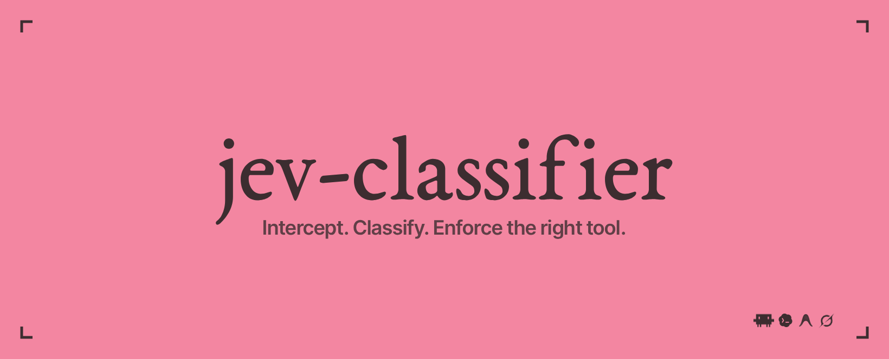

<div align="center">

<h1>
  
</h1>

<p>Windows · macOS · Linux &nbsp; | &nbsp; Node.js 22+ &nbsp; | &nbsp; MIT</p>

<p>
  <a href="#quick-start">Quick start</a> ·
  <a href="#agent-integrations">Integrations</a> ·
  <a href="#monitoring">Monitoring</a> ·
  <a href="#settings">Settings</a> ·
  <a href="#reference">Reference</a>
</p>

</div>

---

jev-classifier connects your coding agent to [Jev](https://typesafe.ai), a model that predicts
which tool to use next. Start by watching its suggestions. Then, where supported, let it choose
the tool your agent calls. Every decision goes into a log you can review.

Keep using your agent's model and login. Configure a separate key for Jev during setup.

| Connection | Agents | How it works |
|---|---|---|
| Proxy | Codex, Claude Code, Grok Build, OpenCode | Requests pass through jev-classifier on their way to the model |
| MCP tool | Cursor, Antigravity | The agent calls Jev when it wants a suggestion |

> Codex Responses Lite records suggestions without forcing a tool. OpenCode supports API keys
> with its v1 configuration. Cursor and Antigravity choose when to ask Jev and whether to follow it.

## Quick start

### 1. Install and configure

You'll need Node.js 22 or newer. From this checkout, run:

```sh
npm install
npm run build
node dist/cli.js setup
```

Setup walks you through choosing a Jev provider, entering its key, and picking your agent.
You don't need to set environment variables. Your choices are saved for all projects.

Choose **Observe** to watch Jev's decisions first. If you don't have a key yet, choose
**Offline test** to check the connection without calling Jev. Review your settings, then save.

<details>
<summary>Global installation</summary>

```sh
npm install -g jev-classifier
jev-classifier setup
```

</details>

The examples below use `jev-classifier`. From a checkout, replace it with `node dist/cli.js`.
Running either without a command opens the interactive menu.

### 2. Connect an agent

| Agent | Command |
|---|---|
| Codex | `jev-classifier run codex` |
| Claude Code | `jev-classifier run claude` |
| Grok Build | `jev-classifier run grok` |
| OpenCode | `jev-classifier run opencode` |
| Cursor | `jev-classifier connect cursor` |
| Antigravity | `jev-classifier connect antigravity` |

For Codex, Claude Code, Grok Build, and OpenCode, `run` starts the gateway and opens your agent.
If the gateway is already running, it uses that one. Connection settings apply to this session;
your agent's configuration files stay as they are.

The gateway keeps running after you close the agent. Stop it with `jev-classifier stop`.
To pass an option to the agent, put it after `--`:

```sh
jev-classifier run codex -- --no-alt-screen
```

For Cursor and Antigravity, open the editor and reload its MCP servers after connecting.

### 3. Check that it works

```sh
jev-classifier doctor --check
jev-classifier status
jev-classifier logs --follow
```

`doctor --check` sends a small request to Jev, which your provider may charge for.
In `status`, watch the request and classification counts increase while your agent works.

For Cursor or Antigravity, ask the agent to call `jev_status`. To try a prediction, ask it
to call `jev_choose_next_tool` with your task and available tools. Check `logs --decisions`
for the result.

## Agent integrations

### Codex, Claude Code, and Grok Build

Pick **Existing login** in setup to use the account you're already signed into. Pick
**Provider API key** to use a separate key for the agent's model. The agent handles sign-in
and refreshes its own login. Jev's key is used only for classification.

For manual setup, run `jev-classifier config <agent>`. You can also expand the connection
instructions in [Reference](#reference). The Grok integration uses the official Grok Build CLI.

### OpenCode

Run `jev-classifier run opencode`. Inside OpenCode:

1. Use `/connect` to add an OpenAI, Anthropic, or xAI API key.
2. Use `/models` to pick a model from that provider.
3. Run a task and check the `opencode` counts in `jev-classifier status`.

This connection supports OpenCode v1 with API keys. Subscription plugins may send requests
directly to the provider and skip the proxy. Other providers and the v2 config format are
not supported yet.

<details>
<summary>How OpenCode settings are applied</summary>

The launcher sets `OPENCODE_CONFIG_CONTENT` for this session. It changes the OpenAI, Anthropic,
and xAI base URLs and keeps your other inline options. Managed OpenCode settings can take
priority, so check `status` to confirm that requests reach the proxy.

See OpenCode's [provider settings](https://opencode.ai/docs/providers/) and
[config priority](https://opencode.ai/docs/config/).

</details>

### Cursor and Antigravity

Run `jev-classifier connect cursor` or `jev-classifier connect antigravity`, then open the
editor and reload its MCP servers. The command adds jev-classifier to your global MCP config,
keeps other servers, and backs up the file before changing it.

The editor starts jev-classifier when it needs the MCP tools. You don't need to run `serve`.
It reads your saved Jev settings; your editor keeps its own login.

| Tool | What to ask |
|---|---|
| `jev_status` | "Call jev_status to check the connection." |
| `jev_choose_next_tool` | "Ask jev_choose_next_tool which tool to use next. Include my task, available tools, and completed actions." |

The agent decides when to ask Jev and whether to follow its suggestion. Jev sees only the
context included in the call, which is sent to your chosen provider. It cannot watch the
whole session or force the agent's next step.

Use `logs --decisions` to review suggestions under `cursor` or `antigravity`.
Restart the editor's MCP server after changing Jev settings. This connection works with
local agents; remote cloud agents cannot use the local process.

<details>
<summary>MCP config files and backups</summary>

| Editor | Config file |
|---|---|
| Cursor | `~/.cursor/mcp.json` |
| Antigravity | `~/.gemini/config/mcp_config.json` |

If the current Antigravity file is missing, an existing
`~/.gemini/antigravity/mcp_config.json` is used.

Running `connect` again leaves an identical entry alone. If the file contains invalid JSON,
the command leaves it untouched. Run `config <editor>` to print the entry and add it yourself.
`run cursor` and `run antigravity` perform the same setup; open the editor yourself afterward.

MCP suggestions have `applied: false` in the decision log. They appear in logs, metrics, and
the dashboard. The HTTP gateway's counters cover only proxy traffic.

See [Cursor MCP](https://cursor.com/docs/mcp) and [Antigravity MCP](https://antigravity.google/docs/mcp).

</details>

## Where Jev runs

Choose a Jev provider in `setup`. Your coding agent keeps using its own model provider.

| Jev provider | API-key variable | Default Jev model |
|---|---|---|
| TypeSafe | `TYPESAFE_API_KEY` | `jev-latest` |
| OpenRouter | `OPENROUTER_API_KEY` | `~typesafe/jev-latest` |
| Vercel AI Gateway | `AI_GATEWAY_API_KEY` | `typesafe-ai/jev` |

OpenRouter and Vercel AI Gateway handle Jev's predictions only. They don't run your agent's
coding model through this tool.

For proxy connections, choose how much control to give Jev:

| Mode | What happens |
|---|---|
| Observe (`shadow`) | Record Jev's prediction, let the agent choose, and compare the two |
| Enforce (`enforce`) | Set `tool_choice` to Jev's prediction when confidence is high enough |

Start with Observe. Change modes in setup, or pass `--shadow` to observe for a run.
Enforce is the default when no mode is configured. It adds a hint instead of forcing a tool
when confidence is low.

jev-classifier keeps the full tool list in every request, so that part of the prompt cache stays
valid. It also checks whether the requested work is done before accepting Jev's suggestion to
respond. If classification fails, the original request continues to the model.

Codex Responses Lite always observes. Requests with duplicate tool names or
`previous_response_id` also fall back to Observe. Check `shadowReason` in the decision log.

<details>
<summary>How predictions work</summary>

The proxy turns the conversation into a `RouterState`, asks Jev which tool comes next and
whether the work is done, then checks both answers. This follows
[`jev-eval-agent`](https://github.com/vinilana/jev-eval-agent).

In enforce mode, `respond_to_user` maps to `tool_choice: auto`. If confidence is below
`MIN_CONFIDENCE`, the proxy adds a hint with the three most likely tools. The `done` gate
can override a suggestion to respond when work remains.

OpenRouter uses its alpha [Decisions API](https://github.com/OpenRouterTeam/typescript-sdk/blob/main/src/funcs/decisionsCreate.ts)
with `choice` and `noul` questions. Vercel uses its
[evaluation API](https://github.com/vercel/ai/blob/main/packages/gateway/src/gateway-evaluation-model.ts)
with `choice` and `boolean`. The boolean probability is used to check completion.

If the provider omits confidence, the chosen option's probability is used.
Missing or invalid probabilities count as a classification failure.

</details>

## Gateway and startup

`jev-classifier serve` (or `start`) frees the original terminal and reuses an existing gateway.
Use `serve --foreground` to keep the server in the current terminal.

| Platform | Default start | Automatic startup |
|---|---|---|
| Windows | Gateway in a separate PowerShell window | Current user's Startup shortcut |
| macOS | Background gateway with a Terminal log viewer | User LaunchAgent at next sign-in |
| Linux desktop | Background gateway with a detected terminal log viewer | XDG desktop autostart at next sign-in |
| Linux headless / SSH | Background gateway; use `logs --follow` | Desktop autostart does not run without a graphical login |

Linux detects `x-terminal-emulator`, `gnome-terminal`, `konsole`, or `xterm`. If no display or usable
terminal is available, the gateway continues in the background. On macOS/Linux, closing the log
viewer leaves the gateway running; use `stop` to end it. On Windows, closing the gateway window
also stops its process. Background console output is saved as `gateway-console.log` alongside
the settings; routine activity and errors are also in the rotating event log.

Choose startup behavior in setup or use these commands:

```sh
jev-classifier startup               # interactive Enable / Disable menu
jev-classifier startup enable        # register for the next desktop sign-in
jev-classifier startup disable
jev-classifier startup status
```

Startup applies to your user account and needs no administrator access. It starts the gateway
when you sign in to your desktop, using your saved settings. It does not run before login.
Disabling startup leaves a running gateway active. Enable it again after moving this checkout
or changing where Node is installed.

<details>
<summary>Startup files and stopping older gateways</summary>

macOS uses `~/Library/LaunchAgents/ai.jev.classifier.plist`. Linux uses
`$XDG_CONFIG_HOME/autostart/jev-classifier.desktop`, or `~/.config/autostart/` by default.

The stop command uses a local control token saved beside your settings. Health responses
do not include that token. If a gateway was started with an older version, close it in its
original terminal once. The new start/stop commands can then manage the next instance.

</details>

## Monitoring

| Command | Shows |
|---|---|
| `doctor` | Installation, saved configuration, and gateway availability |
| `doctor --check` | Whether Jev responds to a test request |
| `status --watch` | Requests, predictions, errors, and the last decision for each agent |
| `logs --follow` | Live gateway and MCP activity; Ctrl+C stops viewing |
| `logs --lines 100` | Recent saved activity, including prior runs |
| `logs --decisions` | Classification history |
| `metrics` | Decision totals grouped by agent, model, and mode |
| `ui` | Dashboard at `http://localhost:8090` |

Prefix commands with `jev-classifier`. Use `--json` with `doctor`, `status`, `settings`, `logs`,
or `startup` for machine-readable output. `--no-color` or `NO_COLOR` disables colors.
Output redirected to a file uses plain text. `status --watch --json` emits one JSON object per line.

`doctor --check` tests the settings loaded for that command. If a gateway is already running,
it may still have older settings; doctor reports when the provider or model differs.
Watch the classification count in `status` to confirm that requests are reaching Jev.
For MCP suggestions, use logs, metrics, or the dashboard.

Gateway and MCP events are saved in `gateway.jsonl` beside the global settings. It rotates at 5 MB
and retains one previous segment. Decision history lives in `decisions.jsonl`, unless customized.
Detached macOS/Linux launches also save console output in `gateway-console.log`.

<details>
<summary>Health counters and Codex observe-mode behavior</summary>

Open `http://127.0.0.1:8080/__jev/health` or run:

```powershell
Invoke-RestMethod http://127.0.0.1:8080/__jev/health
```

`requests` counts incoming proxy traffic; `classified` counts successful Jev decisions.
`classificationFailures`, `noTools`, and `invalidJson` explain requests that passed through without
classification. `jevConfigured` reports whether the selected classifier has a key (not whether authentication succeeded);
`jevProvider` and `jevModel` identify the classifier backend, without exposing credentials;
`stub` identifies offline routing. Counters reset on restart. Decisions are written after the upstream
response ends. The proxy also prints when classification starts and why it skips a request.

Codex 0.154 Responses Lite puts tool declarations in `input` items with `type: "additional_tools"`,
often wrapped in namespaces. The proxy reads those declarations as well as root-level `tools`, without
moving or changing them. **Responses Lite currently always uses shadow mode**, even when
`JEV_MODE=enforce`: forcing a tool in live Codex sessions coincided with repeated intermediate
messages without a final answer. The proxy still asks Jev and logs its prediction, but forwards
the original request byte for byte. The exact cause of that behavior remains under investigation.
The decision log records `mode: "shadow"`, `applied: false`, and `shadowReason`.
Duplicate tool names across declarations also fall back to shadow mode.

</details>

## Settings

Run `jev-classifier setup` to change preferences. Choices are saved globally:

| Platform | Configuration file |
|---|---|
| Windows | `%APPDATA%/jev-classifier/config.json` |
| macOS / Linux | `$XDG_CONFIG_HOME/jev-classifier/config.json`, or `~/.config/jev-classifier/config.json` |

Keys are saved as plain text in this file. On macOS/Linux, a new config file is readable and
writable only by its owner. On Windows, it uses the user folder's permissions. Setup hides keys
on the review screen, and `settings --json` hides their values too.

Logs live beside the config file by default. Set `JEV_CONFIG_HOME` to use a different folder.

Your saved settings work from any project. Before you save them for the first time, the CLI
can load a local `.env` and import it during setup. After that, use `--env-file .env` if you
want to load a project's settings.

When the same setting appears in several places, the first one in this list wins:

1. Command flags.
2. Existing environment variables.
3. An explicitly selected environment file.
4. Saved global preferences.

`--global` skips automatic `.env` loading. Restart the gateway or editor's MCP server after
changing settings. The CLI trusts certificates installed on your computer when Node supports it;
you can change that in advanced settings.

## Reference

<details>
<summary>Manual authentication and connection settings</summary>

Login and token refresh stay in the agent. The proxy forwards each request's credentials; it does not
read credential files, copy refresh tokens, or implement another browser login. Configure a separate
Jev key in setup (TypeSafe, OpenRouter, or Vercel AI Gateway), unless using `JEV_STUB=1`.

| Agent | Local base URL | Session destination |
|---|---|---|
| Claude Code | `http://127.0.0.1:8080/oauth/claude` | `https://api.anthropic.com` |
| Codex | `http://127.0.0.1:8080/oauth/codex` | `https://chatgpt.com/backend-api/codex` |
| Official Grok Build | `http://127.0.0.1:8080/oauth/grok/v1` | `https://cli-chat-proxy.grok.com/v1` |

**Claude Code**, in PowerShell:

```powershell
Remove-Item Env:ANTHROPIC_API_KEY -ErrorAction SilentlyContinue
Remove-Item Env:ANTHROPIC_AUTH_TOKEN -ErrorAction SilentlyContinue
$env:ANTHROPIC_BASE_URL = "http://127.0.0.1:8080/oauth/claude"
claude
```

Use `/login` if needed. Disable an existing `apiKeyHelper` when using subscription login.
Claude's OAuth capability headers are preserved. [Claude gateway authentication](https://code.claude.com/docs/en/llm-gateway#subscriptions-and-gateways).

**Codex**: merge into the user-level `$CODEX_HOME/config.toml` (default `~/.codex/config.toml`):

```toml
model_provider = "jev" # top level, before any [table]

[model_providers.jev]
name = "jev-classifier"
base_url = "http://127.0.0.1:8080/oauth/codex"
wire_api = "responses"
requires_openai_auth = true
supports_websockets = false
```

No `env_key` for this flow. Run `codex login` if needed and use `codex login status` to confirm
ChatGPT login, then start `codex`. API-key login belongs on `/api/codex/v1` instead.
[Codex authentication](https://learn.chatgpt.com/docs/auth#alternative-model-providers).

**Official Grok Build**, in PowerShell:

```powershell
Remove-Item Env:XAI_API_KEY -ErrorAction SilentlyContinue
Remove-Item Env:GROK_MODELS_BASE_URL -ErrorAction SilentlyContinue
grok login # only if not already signed in
$env:GROK_CLI_CHAT_PROXY_BASE_URL = "http://127.0.0.1:8080/oauth/grok/v1"
grok
```

Remove per-model `api_key` / `env_key` overrides to use the session. This is the official Grok Build,
not third-party CLIs also named `grok`. Endpoint variable confirmed in the installed Grok 1.0.34
embedded documentation. [Grok authentication](https://docs.x.ai/build/enterprise#authentication).

Session routes ignore `UPSTREAM`, API upstream variables, and `UPSTREAM_API_KEY`, so gateway
settings cannot replace a session token or redirect it to another provider. Trusted deployments can
override `CLAUDE_OAUTH_UPSTREAM`, `CODEX_OAUTH_UPSTREAM`, or `GROK_OAUTH_UPSTREAM` explicitly.
Auxiliary routes (models, compact, token counting) use the same selected destination. A 401 is passed
back to the agent; the proxy does not retry or refresh credentials. Capture files omit auth/account
headers and query strings; request bodies can still contain private prompts and code.

Direct OAuth integrations are **Claude Code, Codex, and official Grok Build**. Their API-key routes are
`/api/claude`, `/api/codex`, and `/api/grok`; append the API path such as `/v1/responses`.
`env_key` is the **name** of an environment variable, never its secret value.
OpenRouter and Vercel AI Gateway are classifier backends only; they are not agent destinations.

Validation uses local mock upstreams (routing, token changes, 401, headers, logging, JSON/SSE).
Live subscription inference has not been verified. Codex uses HTTP/SSE here; WebSockets are unsupported.

</details>

<details>
<summary>Environment variables for automation</summary>

Use setup for everyday changes. For scripts and automation, you can also use environment variables.
For example, save this in a file and load it with `--env-file .env`:

```dotenv
JEV_PROVIDER=openrouter
OPENROUTER_API_KEY=your-openrouter-key
```

For Vercel, use `JEV_PROVIDER=vercel` and `AI_GATEWAY_API_KEY`. No upstream override is needed.
`JEV_MODEL` selects the classifier model, not the coding model.

| Var | Default | Use |
|---|---|---|
| `JEV_PROVIDER` | `typesafe` | Jev backend: `typesafe`, `openrouter`, or `vercel` |
| `TYPESAFE_API_KEY` | (unset) | classifier key for TypeSafe |
| `OPENROUTER_API_KEY` | (unset) | classifier key for OpenRouter |
| `AI_GATEWAY_API_KEY` | (unset) | classifier key for Vercel AI Gateway |
| `JEV_API_KEY` | (unset) | optional override for the selected classifier key |
| `JEV_MODEL` | provider-specific | Jev model ID override |
| `JEV_STUB` | `0` | `1` routes without Jev, no API key needed |
| `JEV_MODE` | `enforce` | `enforce` rewrites `tool_choice`; `shadow` only logs |
| `DONE_THRESHOLD` | `0.5` | minimum probability that the requested work is done |
| `MIN_CONFIDENCE` | `0.5` | below this, no tool is forced |
| `PORT` | `8080` | proxy port |
| `ANTHROPIC_UPSTREAM` | `https://api.anthropic.com` | upstream for `/v1/messages` |
| `OPENAI_UPSTREAM` | `https://api.openai.com` | upstream for `/v1/responses` |
| `XAI_UPSTREAM` | `https://api.x.ai` | upstream for `/v1/chat/completions` |
| `UPSTREAM` | Unset | overrides API-key route destinations; ignored on `/oauth/*` |
| `UPSTREAM_API_KEY` | Unset | replaces API-route credentials; ignored on `/oauth/*` |
| `CLAUDE_OAUTH_UPSTREAM` | `https://api.anthropic.com` | session destination for `/oauth/claude` |
| `CODEX_OAUTH_UPSTREAM` | `https://chatgpt.com/backend-api/codex` | session destination for `/oauth/codex` |
| `GROK_OAUTH_UPSTREAM` | `https://cli-chat-proxy.grok.com` | session destination for `/oauth/grok` |
| `JEV_LOG` | global config directory + `/decisions.jsonl` | decision log |
| `JEV_DEFAULT_AGENT` | `codex` | default for `run` |
| `JEV_AUTH` | `oauth` | authentication for Codex, Claude Code, and Grok Build |
| `JEV_SYSTEM_CA` | `1` | trust system certificates when supported |
| `JEV_CONFIG_HOME` | OS-specific | global settings directory |

</details>

<details>
<summary>Decision records and request captures</summary>

Metrics and the dashboard read the same decision JSONL. Example record:

```json
{
  "ts": "2026-09-17T12:00:00.000Z",
  "agent": "anthropic",
  "model": "example-model",
  "session": "example-session",
  "mode": "enforce",
  "chosen": "Edit",
  "confidence": 0.82,
  "done": 0.1,
  "gated": false,
  "truncated": false,
  "top3": [
    {
      "name": "Edit",
      "p": 0.82
    }
  ],
  "jevMs": 180,
  "upstreamMs": 2400,
  "toolsCount": 14,
  "applied": true,
  "actual": "Edit",
  "match": true
}
```

`jev-classifier serve --capture` saves requests in `.jev-classifier/captures/`.
It removes authentication and account headers, plus query strings. Request bodies can still
contain private prompts and code. Review captures before sharing them.

</details>

<details>
<summary>Troubleshooting</summary>

| Symptom | Check |
|---|---|
| No proxy requests appear | Start the agent through `run`; confirm the gateway port and selected provider |
| Jev is configured but classifications fail | Run `doctor --check`; inspect provider/model settings and `logs` |
| Changes do not affect the running session | Restart the gateway or editor's MCP server |
| Cursor or Antigravity has no HTTP counters | Check MCP discovery with `jev_status` and activity in `logs --decisions` |
| Codex reports an observe-mode fallback | Responses Lite intentionally preserves requests; inspect `shadowReason` |
| A managed Windows computer reports certificate errors | Check system trust; Node 22.19+ also supports `node --use-system-ca dist/cli.js serve` |

</details>

## Limits

- Jev accepts up to 255 choices, including `respond_to_user`. Larger catalogs are shortened
  for classification and marked `truncated`. The full tool list still goes to your agent's model.
- Each prediction takes time. Check `jevMs` in the log and the p95 timing in metrics to see
  how much delay Jev adds.

## Development

```sh
npm install
npm run typecheck
npm test
```

CI is configured for Windows, macOS, and Linux with Node 22 and 24. Tests cover protocol forwarding,
MCP stdio discovery and calls, configuration merging, process control, and startup-file generation.
The new integrations were developed and tested on Windows; native macOS/Linux desktop launches
and real Cursor/Antigravity sessions still require platform validation. OpenCode's configuration
and mock upstream routing are tested separately from live provider inference.

## License

[MIT](./LICENSE).
